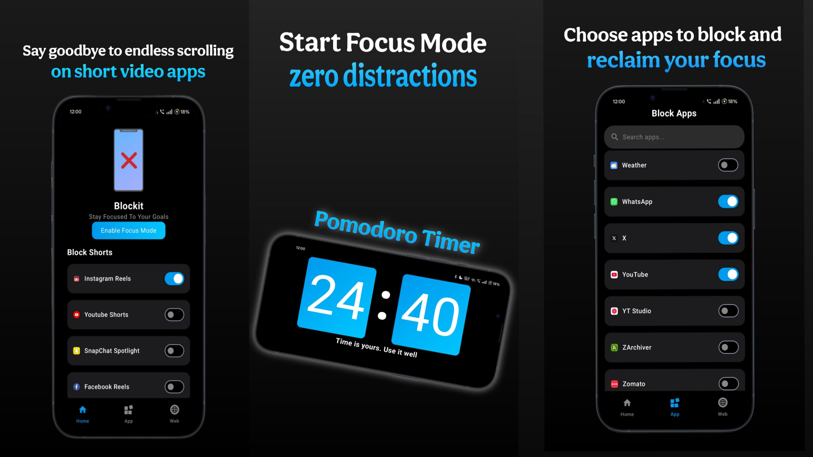
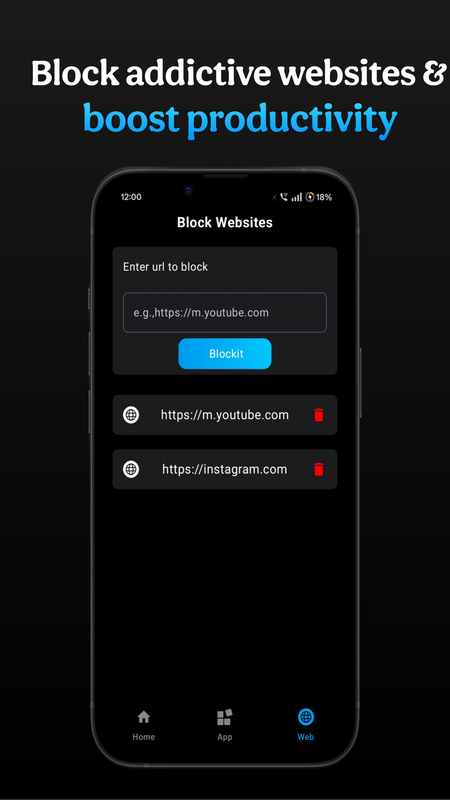

<h1 align="center">🚫 Blockit</h1>

A powerful distraction blocker to help you stay focused and crush your goals 🧠📵

  
  
  

---

## ✨ Overview

**Blockit** is an open-source Android app built to help you block distractions like short videos, apps, and websites — so you can focus on what actually matters.

> Built in public. Designed for creators, students, developers, and anyone who wants to reclaim their time.

---

## 🚀 Features

- 🔕 **Shorts Blocking**  
  Block short-form content from apps like YouTube, Instagram & Snapchat to stop doom-scrolling.

- 📱 **App Blocking**  
  Block selected apps and prevent yourself from opening them during focus time.

- 🌐 **Website Blocking**  
  Add distracting websites and restrict them right from your device.

- 🔔 **Notifications**  
  Gentle nudges to remind you blocking is active and you're in focus mode.

---

## 📸 Screenshots

| Shorts Blocking | App Blocking | Website Blocking |
|-----------------|--------------|------------|
|  |  |  |  

---

## 🛠️ Tech Stack

- Kotlin (Android)
- Jetpack Compose
- MVVM Architecture
- Notifications
- Accessibility Service

---

## ⚙️ Download
- Download the App from releases
